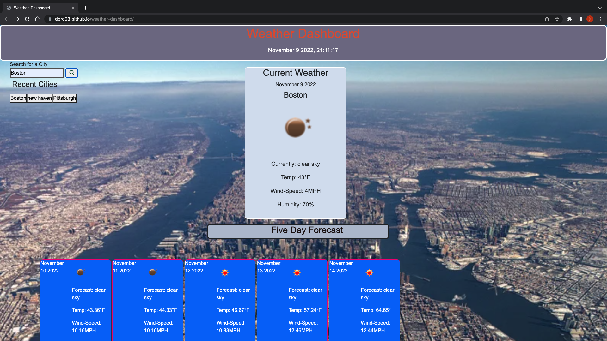

# Weather Dashboard

## Description

Weather dashboard uses a third party API from Open Weather map to request weather data from cities searched.
Users can search for a US city and receive current conditions and a five day forecast for that city on one page. Recents searches are saved underneath the search bar for easy subsequent access to commonly used places. The storage saves five prior searches, then, when a new search is made, the oldest search drops off.

## User Story

AS A traveler 
I WANT to see the weather outlook for multiple cities 
SO THAT I can plan a trip accordingly 

## Acceptance Criteria

GIVEN a weather dashboard with form inputs 
WHEN I search for a city 
THEN I am presented with current and future conditions for that city and that city is added to the search history 
WHEN I view current weather conditions for that city 
THEN I am presented with the city name, the date, an icon representation of weather conditions, the temperature, the humidity, and the the wind speed 
WHEN I view future weather conditions for that city 
THEN I am presented with a 5-day forecast that displays the date, an icon representation of weather conditions, the temperature, the wind speed, and the humidity 
WHEN I click on a city in the search history 
THEN I am again presented with current and future conditions for that city 

## Access

### Weather dashboard can be found at the following URL...

https://dpro03.github.io/weather-dashboard/

### The URL of the GitHub repository...

https://github.com/Dpro03/weather-dashboard.git

## Visual

 

## Usage

<ul>
<li>When a user opens up the weather dashboard, a search bar is available.</li>

<ul>
<li>
Type in a US city to render the weather.
</li>
</ul>

<li>The current weather conditions for the city will display the values of...</li>
<ul>

<li> date </li>
<li> temperature </li>
<li> humidity </li>
<li> wind speed </li>
<li>
 weather icon 
</li>
</ul>
<li> 
 The Five day forcast underneath will display the same values.
</li>

<li>Each City that is searched will be saved to local storage and added to a Search History list.</li> 
<ul>
<li>Each city in the search history list has an attribute of a button.</li>
<li>When the City button is clicked the weather forecast will render to the page again.</li>
</ul>
</ul>

## Support

For help with this application, please contact

| Name | Email |
|------|-------|
|Dave Proto | dpro308@gmail.com|

## Authors and acknowledgment

Some HTML and CSS credit to be given to © 2022 Trilogy Education Services, LLC, a 2U, Inc. brand. as I referenced some of our class activities as a start to build upon my project.

Primary credit to be given to Dave Proto. JavaScript file optimized and enhanced code credit credit given to Dave Proto.

Acknowledgement to Uconn Full Stack Web Developer Bootcamp, Teachers and Teacher assistants for supporting me on my developer journey!

Acknowledgment to third party API from Open Weather for providing the data we are searching for.

## License

**N/A**

